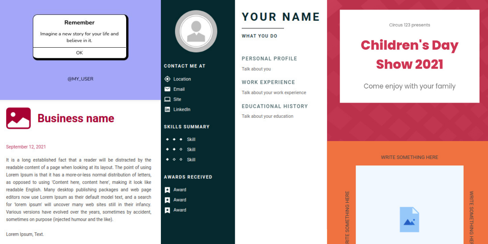

Get Docs is an opensource website that provides quick creation of documents such as: resume, Instagram post, letters, announcements and others.

## Get started
First, make a clone of the project for your computer:
```
git clone https://github.com/pedro-isacss/get-docs
```

Now install the necessary dependencies with:
```
yarn install
```

Finally start the development server:
```
yarn start
```

If all went well, you can now see Get Docs running on **localhost:3000/get-docs**.

## Licence
Get Docs is [MIT licensed](https://github.com/pedro-isacss/get-docs/blob/master/LICENSE).

## Author
Hi, my name is Pedro Isac.

[](https://mail.google.com/mail/u/0/?to=ss.pedroisac@gmail.com&tf=cm)
[](https://linkedin.com/in/pedro-isacss)
